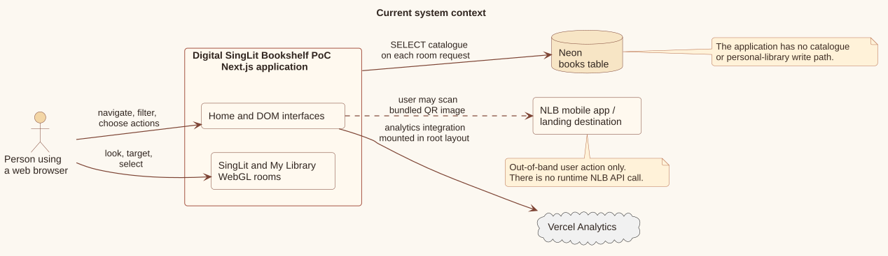
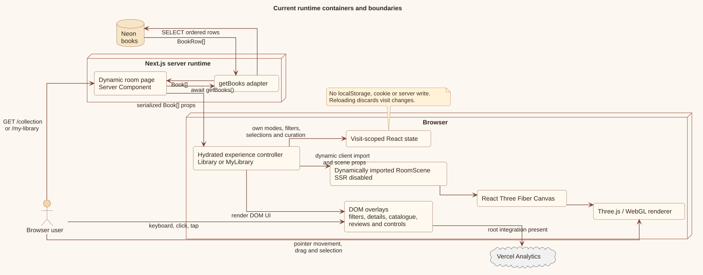
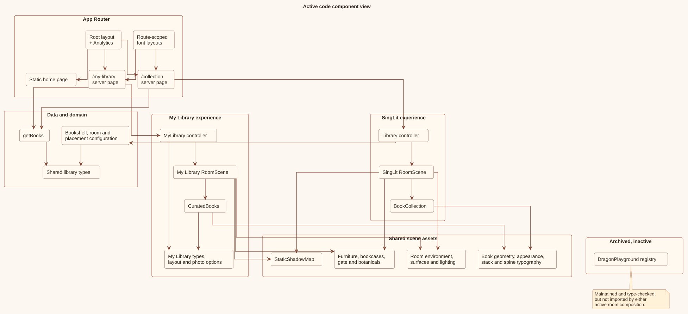
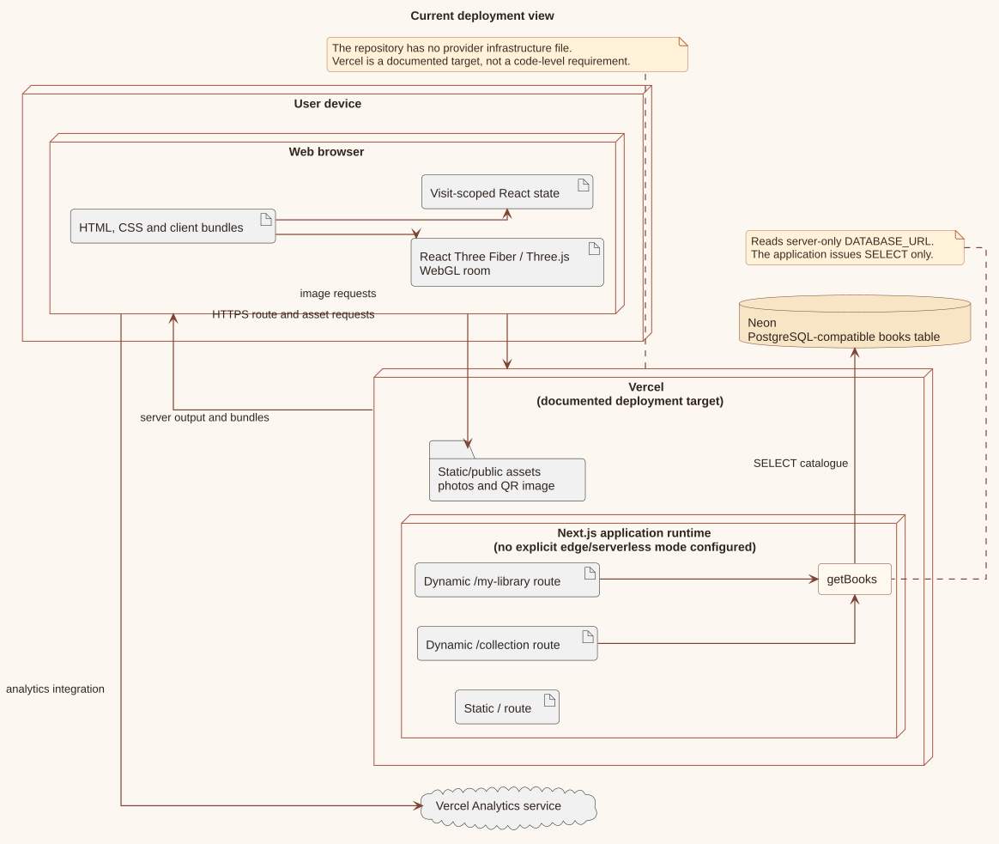
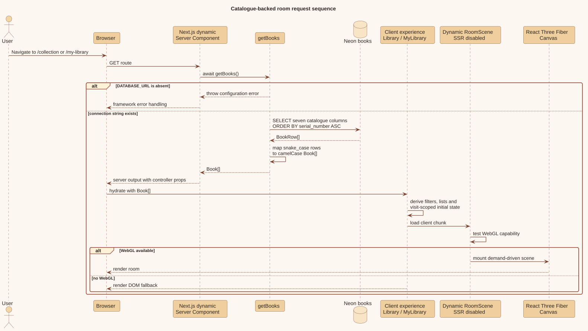
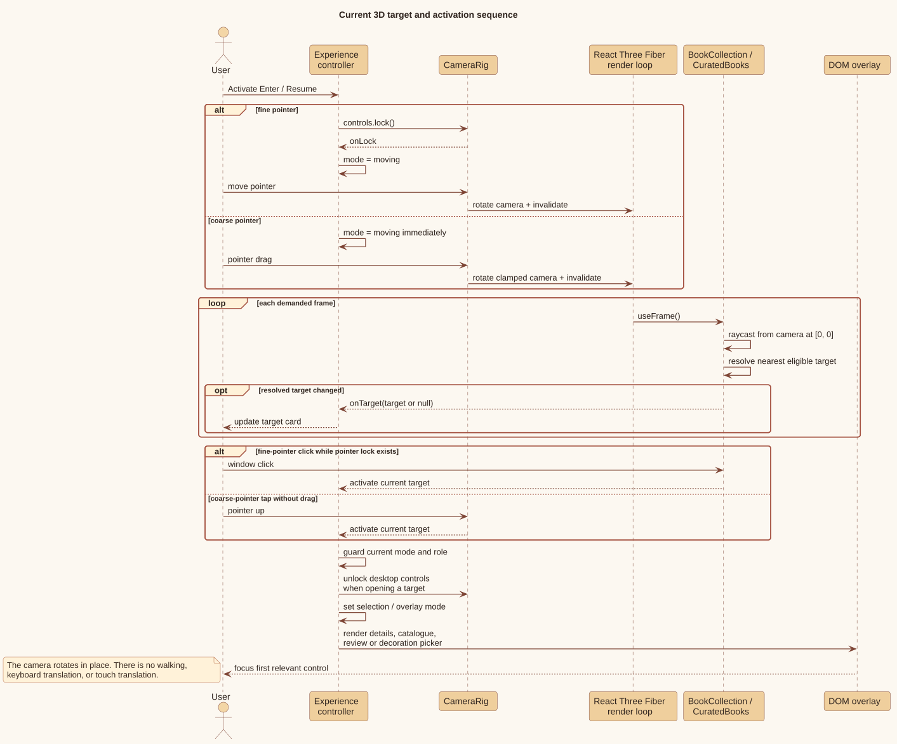

# Architecture

The project is a Next.js App Router application with server-rendered catalogue routes and client-rendered interactive rooms. Neon is the only application data service. The browser renders both ordinary DOM overlays and a client-only React Three Fiber canvas.

## Technology stack

| Concern | Current implementation |
| --- | --- |
| Framework | Next.js 14.2 with React 18 and the App Router |
| Language | TypeScript 5.5 in strict, no-emit mode |
| 3D rendering | Three.js 0.170, React Three Fiber 8.18, Drei 9.122 |
| Database access | `@neondatabase/serverless` with `DATABASE_URL` |
| Analytics | `@vercel/analytics` mounted in the root layout |
| Styling | One application-wide CSS file plus route-scoped Next font variables |

Dependency versions are recorded in [`package.json`](../package.json). No application API route, state-management library, authentication SDK, or object-storage client is present.

**Implementation anchors:** [`package.json`](../package.json); [`tsconfig.json`](../tsconfig.json); [`src/app/layout.tsx`](../src/app/layout.tsx); [`src/app/collection/layout.tsx`](../src/app/collection/layout.tsx); [`src/app/my-library/layout.tsx`](../src/app/my-library/layout.tsx).

## System context

[PlantUML source](diagrams/source/system-context.puml)

The application reads catalogue data from Neon. It does not write catalogue or personal-library data. Vercel Analytics is loaded by the root layout. The NLB mobile application is not a runtime dependency: the browser displays a bundled QR image and the user may scan it with another device.

**Implementation anchors:** [`src/data/books.ts`](../src/data/books.ts), `getBooks`; [`src/app/layout.tsx`](../src/app/layout.tsx), `Analytics`; [`src/experiences/singlit/Library.tsx`](../src/experiences/singlit/Library.tsx), borrow rendering; [`public/NLBMobile_QR.png`](../public/NLBMobile_QR.png).

## Runtime and server/client boundary

[PlantUML source](diagrams/source/runtime-containers.puml)

`/` is static. `/collection` and `/my-library` export `dynamic = "force-dynamic"` and call `getBooks()` from asynchronous server components. The database rows are mapped into camelCase `Book` objects before being passed to a client experience component.

Each experience dynamically imports its `RoomScene` with `ssr: false`. This keeps the WebGL canvas and browser APIs on the client while ordinary route rendering and catalogue loading remain on the server. Inside the browser:

- the experience controller owns modes, selections, filters, and visit-scoped data;
- DOM overlays provide entry, pause, filter, detail, catalogue, and review interfaces;
- `RoomScene` mounts the React Three Fiber `Canvas`;
- rendering modules translate books and state into Three.js meshes;
- `CameraRig` adapts pointer-lock and touch interaction to a small `RoomControlsHandle`.

There is no HTTP/JSON boundary between the server page and experience controller beyond normal React server-to-client serialization.

**Implementation anchors:** [`src/app/page.tsx`](../src/app/page.tsx); [`src/app/collection/page.tsx`](../src/app/collection/page.tsx); [`src/app/my-library/page.tsx`](../src/app/my-library/page.tsx); both experience controllers' `dynamic()` declarations; both `RoomScene` modules.

## Active module composition

[PlantUML source](diagrams/source/module-components.puml)

The two experiences share:

- the `Book` and room-related domain types;
- server-side catalogue loading;
- room surfaces, lighting, bookcases, furniture, book geometry, book appearance, typography, and static-shadow support;
- a common font scope for English, Chinese, Tamil, and Malay spine titles.

They do not share their interaction controller or their main book renderer:

- SingLit uses `Library` → `RoomScene` → `BookCollection`;
- My Library uses `MyLibrary` → `RoomScene` → `CuratedBooks`.

`src/components/room-decor/archive` is maintained and type-checked but has no import path into a live room composition, so its dragon playground is not part of either active scene or client bundle.

**Implementation anchors:** imports in [`src/experiences/singlit/RoomScene.tsx`](../src/experiences/singlit/RoomScene.tsx) and [`src/experiences/mylibrary/RoomScene.tsx`](../src/experiences/mylibrary/RoomScene.tsx); [`src/components/room-decor/archive/README.md`](../src/components/room-decor/archive/README.md).

## Deployment view

[PlantUML source](diagrams/source/deployment.puml)

Vercel is the documented target and can host the Next.js server runtime, route assets, and public images. Neon remains a separate PostgreSQL-compatible service reached through `DATABASE_URL`. The repository does not include `vercel.json`, infrastructure as code, a declared edge runtime, or provider-specific function settings, so the diagram deliberately labels Vercel as the documented target rather than a code-enforced requirement.

The browser downloads the DOM/client bundles, Three.js scene code, fonts, photos, and QR image from the application deployment. Analytics events are handled by the mounted Vercel Analytics integration.

**Implementation anchors:** [`README.md`](../README.md); [`src/app/layout.tsx`](../src/app/layout.tsx); [`src/data/books.ts`](../src/data/books.ts); `public/`; absence of provider configuration in the repository root.

## Request sequence

[PlantUML source](diagrams/source/catalogue-request-sequence.puml)

For either room:

1. Next.js executes the dynamic server page.
2. `getBooks` requires `DATABASE_URL`, creates a Neon SQL client, and selects seven columns ordered by `serial_number ASC`.
3. The adapter maps each snake_case row to a `Book`.
4. The page passes the full array to its client controller.
5. The browser hydrates DOM UI and loads the `RoomScene` client chunk.
6. If WebGL is available, the scene creates a demand-driven canvas and renders the relevant book sets.

A missing connection string throws before the room is rendered. Query errors likewise propagate through framework error handling; this repository has no route-specific error boundary.

**Implementation anchors:** [`src/data/books.ts`](../src/data/books.ts), `BookRow`, `getBooks`; both room page modules; both experience controllers' WebGL detection and dynamic scene import.

## 3D selection sequence

[PlantUML source](diagrams/source/room-interaction-sequence.puml)

Both scenes cast a ray through normalized device coordinate `[0, 0]`, the crosshair at the centre of the camera. Renderers notify the controller only when the resolved target changes.

- On desktop, a window click activates the current target only while `document.pointerLockElement` exists.
- On a coarse pointer, a drag rotates the camera; a tap that did not exceed the movement threshold activates the current target.
- The controller changes mode and, for desktop selection, releases pointer lock before presenting the DOM overlay.

SingLit rays target matching and filtered shelf meshes plus the table stack, but filtered shelf hits are intentionally not selectable. My Library rays target curated book spines, its current-read stack, the reading shelf, and owner-editable picture/flower objects.

**Implementation anchors:** [`src/experiences/singlit/BookCollection.tsx`](../src/experiences/singlit/BookCollection.tsx), `RealisticBooks`; [`src/experiences/mylibrary/CuratedBooks.tsx`](../src/experiences/mylibrary/CuratedBooks.tsx); both `CameraRig` implementations; controller `openBook`/`openTarget` functions.

## Rendering and performance design

The code uses several explicit measures to control scene cost:

- `frameloop="demand"` and `invalidate()` render only when scene/camera state changes.
- Repeated books, boards, pages, architectural boxes, cylinders, and botanical parts use instanced meshes.
- Book render profiles, placement matrices, colors, raycasters, and raycast arrays are memoized or reused.
- Spine titles are drawn into canvas texture atlases and rendered in geometry batches limited by the GPU's maximum texture size.
- Non-matching SingLit books are split into lower-opacity instanced layers rather than rebuilt as independent objects.
- Shadows are disabled for coarse-pointer mode and otherwise use a static shadow map invalidated when scene-affecting state changes.
- Three.js geometry, material, texture, and render-target resources created by components are disposed during cleanup.

These are implementation techniques, not measured performance guarantees. The repository contains no performance budgets, telemetry for frame rate, or automated WebGL benchmark.

**Implementation anchors:** both `RoomScene` modules; [`src/experiences/singlit/BookCollection.tsx`](../src/experiences/singlit/BookCollection.tsx); [`src/experiences/mylibrary/CuratedBooks.tsx`](../src/experiences/mylibrary/CuratedBooks.tsx); [`src/components/scene-assets/StaticShadowMap.tsx`](../src/components/scene-assets/StaticShadowMap.tsx); modules under `src/components/scene-assets/books/`.
