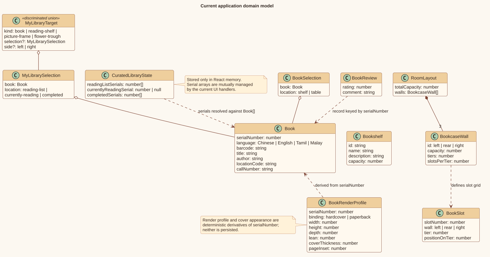
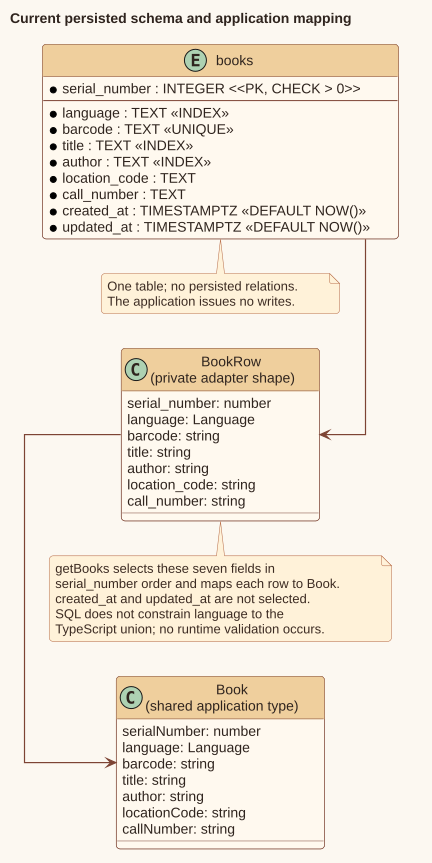
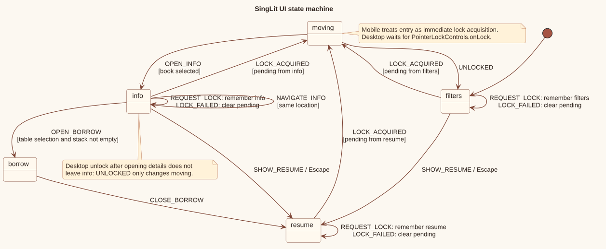
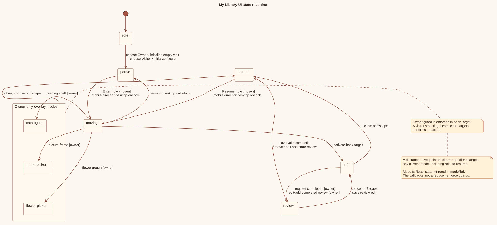

# Data model and state

The project has one persisted application entity: a catalogue book in Neon. Everything that changes during a room visit is held in the browser's React component state.

## State ownership

| Data | Owner | Persistence | Reset behavior |
| --- | --- | --- | --- |
| Catalogue book rows | Neon `books` table | Database | Survives application sessions |
| Mapped `Book[]` | Dynamic server page, then client props | One request/page instance | Reload performs another query |
| SingLit filter field and query | `Library` | React memory | Reload clears |
| SingLit table serials | `Library` | React memory | Reload returns all books to shelves |
| My Library role | `MyLibrary` | React memory | Reload returns to role choice |
| Reading list/current/completed serials | `MyLibrary` | React memory | Reload clears or reconstructs the visitor demo after role choice |
| Reviews | `MyLibrary` | React memory | Reload clears or reconstructs visitor examples |
| Frame photo and flowers | `MyLibrary` | React memory | Reload clears or reconstructs visitor defaults |
| Active modes, selections, and targets | Experience controllers/renderers | React refs/state | Cleared as components unmount |

There is no browser storage, cookie, personal-library table, write endpoint, or catalogue mutation in the codebase.

**Implementation anchors:** state declarations in [`src/experiences/singlit/Library.tsx`](../src/experiences/singlit/Library.tsx) and [`src/experiences/mylibrary/MyLibrary.tsx`](../src/experiences/mylibrary/MyLibrary.tsx); [`src/data/books.ts`](../src/data/books.ts); repository-wide absence of `localStorage`, `sessionStorage`, cookies, and application fetch calls.

## Domain model

[PlantUML source](diagrams/source/domain-model.puml)

`Book` is the shared catalogue model. `BookSelection` adds the transient SingLit location (`shelf` or `table`), while `MyLibrarySelection` adds a curated location (`reading-list`, `currently-reading`, or `completed`).

Room and render types describe deterministic placement rather than persisted entities:

- `RoomLayout` contains three `BookcaseWall` records;
- `BookSlot` maps a configured slot to wall, tier, and position;
- `BookRenderProfile` derives physical book dimensions and binding from a serial number;
- `BookAppearance` derives a solid or image-backed cover without changing the book data.

My Library stores only catalogue serial numbers in `CuratedLibraryState`, resolving them against the request's `Book[]`. Missing serial numbers are ignored when the displayed lists are derived.

**Implementation anchors:** [`src/types/library.ts`](../src/types/library.ts); [`src/experiences/mylibrary/types.ts`](../src/experiences/mylibrary/types.ts); [`src/components/scene-assets/books/bookVisuals.ts`](../src/components/scene-assets/books/bookVisuals.ts); [`src/components/scene-assets/books/bookAppearance.ts`](../src/components/scene-assets/books/bookAppearance.ts).

## Database schema and mapping

[PlantUML source](diagrams/source/database-schema.puml)

The schema creates one table:

| Database column | Constraint | `Book` field |
| --- | --- | --- |
| `serial_number` | Positive integer primary key | `serialNumber` |
| `language` | Non-null text | `language` |
| `barcode` | Non-null unique text | `barcode` |
| `title` | Non-null text, indexed | `title` |
| `author` | Non-null text, indexed | `author` |
| `location_code` | Non-null text | `locationCode` |
| `call_number` | Non-null text | `callNumber` |
| `created_at` | Non-null timestamp, default now | Not selected |
| `updated_at` | Non-null timestamp, default now | Not selected |

`language` is cast to the TypeScript union `"Chinese" | "English" | "Tamil" | "Malay"` in `BookRow`, but the SQL schema has no corresponding check constraint and the adapter performs no runtime validation. The SQL indexes `language`, `title`, and `author`; the current application still fetches all rows and performs user-entered filtering in browser memory.

The schema file is declarative SQL only. The application does not invoke it, update timestamps, seed records, or run migrations.

**Implementation anchors:** [`database/001_create_books.sql`](../database/001_create_books.sql); [`src/data/books.ts`](../src/data/books.ts), `BookRow` and `getBooks`; [`src/types/library.ts`](../src/types/library.ts), `Language`, `Book`.

## Capacities and invariants

| Area | Implemented invariant | Enforcement |
| --- | --- | --- |
| SingLit room | 600 slots | Three configured 200-slot walls |
| Wall | 8 tiers × 25 slots | `roomLayout` and generated `bookSlots` |
| Shelf placement | Serial number `n` uses slot index `n - 1` | Renderer omits invalid/out-of-capacity or duplicate serials |
| SingLit table | At most 5 books | Disabled action and handler guard |
| My Library reading list | At most 32 books | 4 tiers × 8 slots and add guard |
| My Library current read | Zero or one book | Nullable single serial |
| My Library completed shelf | At most 200 books | 8 tiers × 25 slots and completion guard |
| My Library membership | A serial appears in only one curated location through UI actions | Add and transition handlers |
| Review rating | Integer button choice from 1 to 5 required to save | Disabled submit and handler range guard |
| Review comment | At most 500 characters in the current UI | `textarea maxLength` |

`mainBookshelf.capacity` is 553, but visual placement uses `roomLayout.totalCapacity` of 600. The bookshelf value is descriptive configuration passed to the experience; it is not used as the renderer's capacity guard.

**Implementation anchors:** [`src/data/room.ts`](../src/data/room.ts); [`src/data/bookshelves.ts`](../src/data/bookshelves.ts); [`src/data/bookPlacement.ts`](../src/data/bookPlacement.ts); [`src/experiences/singlit/BookCollection.tsx`](../src/experiences/singlit/BookCollection.tsx), `getProfiledBooks`; [`src/experiences/mylibrary/layout.ts`](../src/experiences/mylibrary/layout.ts); My Library mutation handlers.

## SingLit interaction state

[PlantUML source](diagrams/source/singlit-ui-state.puml)

`roomReducer` is the authoritative state machine:

- The initial state is `filters`.
- Entry from `filters`, `resume`, or `info` records the originating mode as `pendingLockFrom`. Successful desktop lock or immediate mobile acquisition enters `moving`; failure clears the pending request and stays in the origin.
- Unlocking while moving returns to `filters`.
- A selection can open `info` only from `moving`.
- Detail navigation stays in `info` and only within the selected location.
- The borrow page can open only from a table selection in `info`.
- Closing borrow enters `resume`.
- `Escape` in `filters` or `info` enters `resume`.

Opening details releases desktop pointer lock, but the resulting unlock event does not alter `info` because `UNLOCKED` only changes `moving`.

**Implementation anchors:** [`src/experiences/singlit/Library.tsx`](../src/experiences/singlit/Library.tsx), `RoomState`, `RoomAction`, `roomReducer`, `requestMoving`, keyboard and focus effects.

## My Library interaction state

[PlantUML source](diagrams/source/my-library-ui-state.puml)

My Library stores its mode in both state and a ref so document/pointer callbacks can read the latest value:

- It begins in `role`; choosing either role initializes that visit and enters `pause`.
- Entering or reacquiring controls moves from `pause`/`resume` to `moving`.
- Unlocking or pausing from `moving` enters `pause`.
- Selecting a book from `moving` opens `info` for either role.
- Only an owner can open `catalogue`, `photo-picker`, or `flower-picker` from a scene target.
- Closing those overlays or book information enters `resume`.
- Beginning completion or review editing enters `review`.
- Cancelling a review or saving an edit returns to `info`; saving a completion commits the move and enters `resume`.
- `Escape` follows the same close/cancel paths for the applicable overlays.
- A pointer-lock error enters `resume`.

The type includes all modes but there is no reducer-level transition guard. The callbacks enforce the current-mode and owner-role checks.

**Implementation anchors:** [`src/experiences/mylibrary/types.ts`](../src/experiences/mylibrary/types.ts), `MyLibraryMode`; [`src/experiences/mylibrary/MyLibrary.tsx`](../src/experiences/mylibrary/MyLibrary.tsx), `changeMode`, `chooseRole`, `enterRoom`, `openTarget`, `closeOverlay`, review handlers and keyboard effect.
