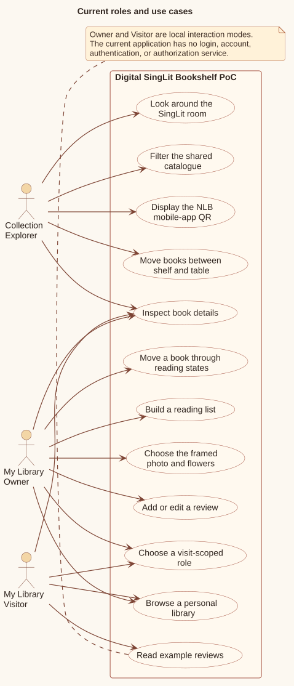
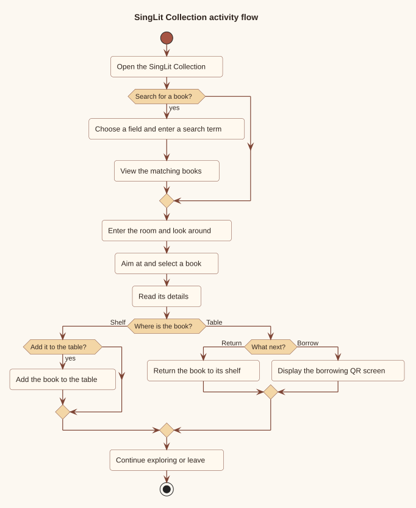
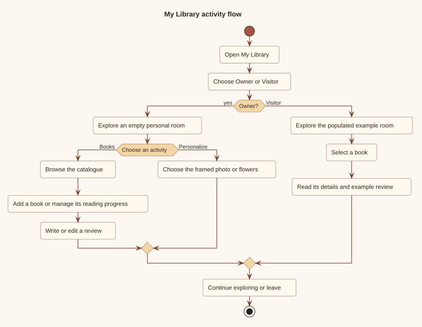
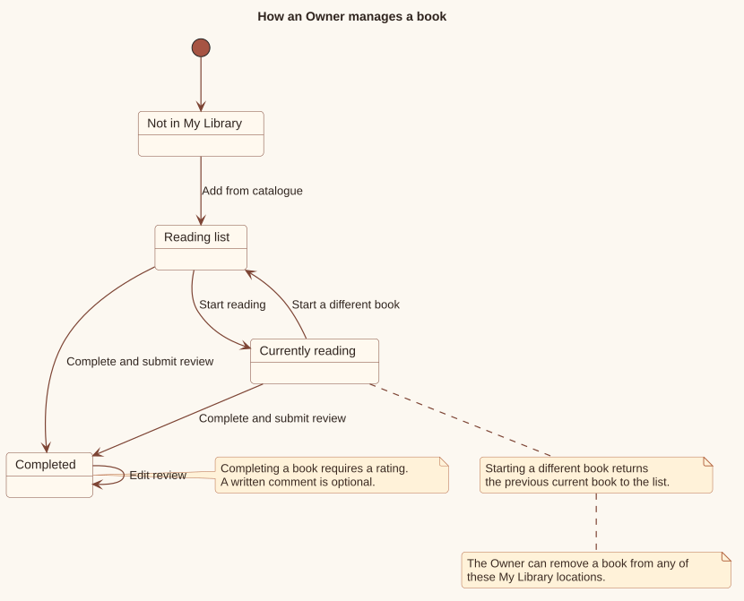

# User guide

The application has a static home page and two catalogue-backed room experiences. Both rooms use a fixed-position camera: visitors look around but do not walk through the space.

**Implementation anchors:** [`src/app/page.tsx`](../src/app/page.tsx), `Home`.

## Roles and capabilities

[PlantUML source](diagrams/source/roles-and-use-cases.puml)

The roles are interaction modes, not identities:

- A **Collection Explorer** searches and browses the shared catalogue, moves up to five books between the shelves and table, and can display the NLB mobile-app QR screen.
- A **My Library Owner** starts with an empty visit-scoped room and can curate books, reviews, a framed image, and flower troughs.
- A **My Library Visitor** receives a deterministic populated example and can read book information and existing example reviews without changing the room.

There is no login, account lookup, authorization service, or server-side owner/visitor record. Reloading the page returns to role selection and discards the current visit.

**Implementation anchors:** [`src/experiences/singlit/Library.tsx`](../src/experiences/singlit/Library.tsx), `Library`; [`src/experiences/mylibrary/MyLibrary.tsx`](../src/experiences/mylibrary/MyLibrary.tsx), `chooseRole`, `visitorLibrary`, `visitorReviews`; [`src/experiences/mylibrary/types.ts`](../src/experiences/mylibrary/types.ts), `MyLibraryRole`.

## Controls

The application treats a coarse pointer as its mobile interaction signal. This is an input-mode check, not a screen-width check.

| Action | Fine pointer / desktop | Coarse pointer / touch |
| --- | --- | --- |
| Enter or resume a room | Activate the entry button; the browser requests pointer lock | Tap the entry button |
| Look around | Move the pointer while pointer lock is active | Drag on the canvas |
| Target an object | Aim the fixed centre crosshair | Aim the fixed centre crosshair |
| Open a target | Click while pointer lock is active | Tap without dragging more than the movement threshold |
| Pause | Press `Escape` or use the pause control | Use the pause control |
| Leave an overlay | Close it, select the backdrop where supported, or press `Escape` | Use the same visible overlay controls |

The camera starts at `[0, 3.53, 0.7]`, looks toward the rear wall, and only rotates. The mobile pitch is clamped; neither experience implements keyboard or touch translation.

**Implementation anchors:** [`src/experiences/singlit/RoomScene.tsx`](../src/experiences/singlit/RoomScene.tsx), `CameraRig`; [`src/experiences/mylibrary/RoomScene.tsx`](../src/experiences/mylibrary/RoomScene.tsx), `CameraRig`; both experience controllers' coarse-pointer effects.

## SingLit Collection

[PlantUML source](diagrams/source/singlit-collection-flow.puml)

### Search and enter

1. Select a query field. The options are generated from the keys of the first returned `Book`, so they cover serial number, language, barcode, title, author, location code, and call number when the catalogue is non-empty.
2. Enter a case-insensitive substring query. With no term or no active field, all books match.
3. Matching books remain fully visible and targetable. Non-matches stay in place with reduced opacity.
4. Activate the room entry control to begin looking around.

The shelf arrangement is serial-number ascending. A serial number maps to slot `serialNumber - 1`; only values within the 600 configured slots are rendered on shelves.

### Inspect and manage books

- Aim at a matching spine or table book and select it to open details.
- Previous and next navigation stays within the current location: the filtered shelf result or the current table stack.
- A shelf book can be moved to the table if the five-book limit has not been reached.
- A table book can be returned to its shelf.
- Selecting **Borrow stack** from a table book replaces the room with a page displaying the bundled NLB QR image.

The QR page does not call an NLB API. It presents `public/NLBMobile_QR.png` for the user to scan out of band.

All filters and table choices are local component state. They are neither written to Neon nor retained across a reload.

**Implementation anchors:** [`src/experiences/singlit/Library.tsx`](../src/experiences/singlit/Library.tsx), `filtered`, `tableSerials`, `addSelectedBookToTable`, `returnSelectedBookToShelf`, `openBorrow`; [`src/data/bookPlacement.ts`](../src/data/bookPlacement.ts); [`src/data/room.ts`](../src/data/room.ts); [`src/experiences/singlit/BookCollection.tsx`](../src/experiences/singlit/BookCollection.tsx), `getProfiledBooks`, `RealisticBooks`.

## My Library

My Library first asks the visitor to choose Owner or Visitor. The choice lasts only for the current visit.

### Owner

[PlantUML source](diagrams/source/my-library-flow.puml)

An owner can:

- target the small left reading-list shelf to open the shared catalogue;
- filter that catalogue by title, author, language, or call number;
- page through results in batches of 50 and add unique books to the 32-book reading list;
- start a reading-list book, moving any previous current book back to the end of the reading list;
- complete a reading-list or current book after supplying a required rating from one to five;
- add an optional comment of up to 500 characters, later edit the review, or remove the book and its review;
- choose one of three bundled images for the wooden frame, or clear it;
- apply orchid, sunflower, or empty styling to both flower troughs.

The completed shelf holds at most 200 books, and only one book can be current.

### Visitor

The catalogue is sorted by serial number before the example is created:

- the first 12 books become completed;
- the 13th becomes the current read when present;
- books 14 through 19 become the reading list;
- two of every three completed books receive a deterministic example review.

Visitors can target books and read their details and reviews. The catalogue shelf, frame, flowers, book state, and reviews cannot be changed in visitor mode.

### Personal-book lifecycle

[PlantUML source](diagrams/source/personal-book-lifecycle.puml)

Completion is committed only after a valid rating is submitted. Cancelling the review leaves the book in its previous location. Removing a completed book also removes its in-memory review.

**Implementation anchors:** [`src/experiences/mylibrary/MyLibrary.tsx`](../src/experiences/mylibrary/MyLibrary.tsx), `EMPTY_LIBRARY`, `visitorLibrary`, `matchingCatalogueBooks`, `addToReadingList`, `startReading`, `moveSelectedToCompleted`, `saveReview`, `removeSelected`; [`src/experiences/mylibrary/layout.ts`](../src/experiences/mylibrary/layout.ts); [`src/experiences/mylibrary/photoOptions.ts`](../src/experiences/mylibrary/photoOptions.ts).

## Accessibility and fallback behavior

The current implementation includes:

- semantic buttons for matching shelf/table books and curated books in visually clipped collections;
- labelled modal dialogs and close controls;
- initial focus movement into role, catalogue, detail, photo, flower, and review dialogs;
- live announcements for targeted objects, catalogue notices, and rating output;
- keyboard-accessible DOM controls for filters, details, navigation, and actions;
- a WebGL capability check before a room canvas is mounted;
- reduced-motion handling for SingLit view transitions.

These provisions are not a claim of WCAG conformance. Focus is moved into dialogs but is not trapped, the 3D scene remains the main discovery surface, and My Library's non-WebGL fallback does not expose equivalent controls for targeting the shelf, picture frame, or flowers. The collection fallback message points to the hidden semantic collection, which is intended for assistive technology rather than as a visible list.

**Implementation anchors:** both experience controllers' dialog markup and focus effects; [`src/app/globals.css`](../src/app/globals.css), `.sr-collection`; both `RoomScene` modules; [`src/experiences/singlit/Library.tsx`](../src/experiences/singlit/Library.tsx), `webgl` and view-transition logic.
