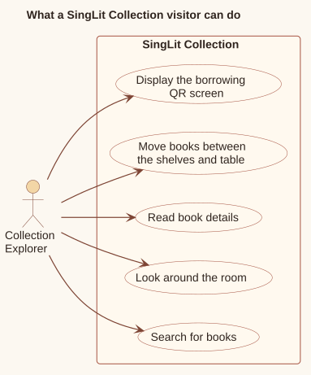
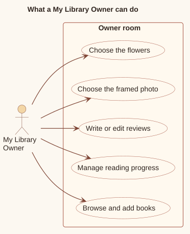
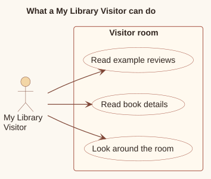

# User guide

The application has a static home page with two independent room experiences:

1. [SingLit Collection](#1-singlit-collection) for searching and exploring the shared catalogue.
2. [My Library](#2-my-library) for an owner-curated or visitor-viewed personal room demonstration.

Both rooms use a fixed-position camera. Visitors look around but do not walk through the space. The roles describe visit-scoped interaction modes, not authenticated identities.

Owner and Visitor are selected after entering My Library. There is no login, account lookup, authorization service, or server-side role record.

**Implementation anchors:** [`src/app/page.tsx`](../src/app/page.tsx), `Home`; [`src/experiences/mylibrary/MyLibrary.tsx`](../src/experiences/mylibrary/MyLibrary.tsx), `chooseRole`; [`src/experiences/mylibrary/types.ts`](../src/experiences/mylibrary/types.ts), `MyLibraryRole`.

## 1. SingLit Collection

The SingLit Collection at `/collection` displays the shared Neon catalogue across three walls. A Collection Explorer can search all application book fields, inspect matching books, move up to five books to the table, and display the bundled NLB mobile-app QR screen.

Filters, the active selection, and table contents exist only in the `Library` React component. Reloading the route queries the catalogue again and resets the experience.

[PlantUML source](diagrams/source/singlit-use-cases.puml)

The Collection Explorer can search, look around, inspect books, manage the table, and open the borrowing QR screen.

### Collection workflow

[PlantUML source](diagrams/source/singlit-collection-flow.puml)

The workflow follows the visitor's choices from search to room exploration. Selecting a book opens its details, after which it can be added to or returned from the table, or used to open the borrowing screen.

### Collection controls

| Action | Fine pointer / desktop | Coarse pointer / touch |
| --- | --- | --- |
| Enter or resume | Activate the entry button; the browser requests pointer lock | Tap the entry button |
| Look around | Move the pointer while pointer lock is active | Drag on the canvas |
| Target a book | Aim the fixed centre crosshair | Aim the fixed centre crosshair |
| Open a targeted book | Click while pointer lock is active | Tap without exceeding the drag threshold |
| Pause | Press `Escape` or use the pause control | Use the pause control |
| Close details | Use the close control, supported backdrop action, or `Escape` | Use the same visible controls |

The camera starts at `[0, 3.53, 0.7]`, looks toward the rear wall, and only rotates. Mobile pitch is clamped; the experience does not implement keyboard or touch translation.

**Implementation anchors:** [`src/experiences/singlit/RoomScene.tsx`](../src/experiences/singlit/RoomScene.tsx), `CameraRig`; [`src/experiences/singlit/Library.tsx`](../src/experiences/singlit/Library.tsx), coarse-pointer and keyboard effects.

### Search and enter

1. Select a query field. Options are generated from the keys of the first returned `Book`, so they cover serial number, language, barcode, title, author, location code, and call number when the catalogue is non-empty.
2. Enter a case-insensitive substring query. With no term or no active field, all books match.
3. Matching books remain fully visible and targetable. Non-matches stay in place with reduced opacity.
4. Activate the room entry control to begin looking around.

The shelf arrangement is serial-number ascending. A serial number maps to slot `serialNumber - 1`; only values within the 600 configured slots are rendered on shelves.

### Inspect and manage books

- Aim at a matching spine or table book and select it to open details.
- Previous and next navigation stays within the current location: the filtered shelf result or the current table stack.
- A shelf book can be moved to the table if the five-book limit has not been reached.
- A table book can be returned to its shelf.
- Selecting **Borrow stack** from a table book replaces the room with a page displaying the bundled NLB QR image.

The QR page does not call an NLB API. It presents `public/NLBMobile_QR.png` for the user to scan out of band.

**Implementation anchors:** [`src/experiences/singlit/Library.tsx`](../src/experiences/singlit/Library.tsx), `filtered`, `tableSerials`, `addSelectedBookToTable`, `returnSelectedBookToShelf`, `openBorrow`; [`src/data/bookPlacement.ts`](../src/data/bookPlacement.ts); [`src/data/room.ts`](../src/data/room.ts); [`src/experiences/singlit/BookCollection.tsx`](../src/experiences/singlit/BookCollection.tsx), `getProfiledBooks`, `RealisticBooks`.

### Collection accessibility and fallback

The collection includes semantic controls for matching shelf and table books in a visually clipped collection, labelled dialogs, focus movement into overlays, live target announcements, and keyboard-operable filter and detail controls. It checks for WebGL before mounting the room and respects reduced-motion preferences for view transitions.

These provisions are not a claim of WCAG conformance. Focus is moved but not trapped, and the collection's WebGL fallback points to a hidden semantic collection intended for assistive technology rather than a visible list.

**Implementation anchors:** [`src/experiences/singlit/Library.tsx`](../src/experiences/singlit/Library.tsx), dialog markup, focus effects, `webgl`, and view-transition logic; [`src/app/globals.css`](../src/app/globals.css), `.sr-collection`; [`src/experiences/singlit/RoomScene.tsx`](../src/experiences/singlit/RoomScene.tsx).

## 2. My Library

My Library at `/my-library` begins with a choice between Owner and Visitor. The choice lasts only for the current visit and initializes a different in-memory room:

- [Owner](#21-my-library-owner) starts with an empty room and can make changes.
- [Visitor](#22-my-library-visitor) receives a deterministic populated example and can only browse it.

[PlantUML source](diagrams/source/my-library-flow.puml)

The workflow branches immediately after role selection. Owners can manage books and personalize the room; Visitors can explore the populated example and read its book information.

### Shared My Library controls

| Action | Fine pointer / desktop | Coarse pointer / touch |
| --- | --- | --- |
| Enter or resume | Activate the entry button; the browser requests pointer lock | Tap the entry button |
| Look around | Move the pointer while pointer lock is active | Drag on the canvas |
| Target an object | Aim the fixed centre crosshair | Aim the fixed centre crosshair |
| Open a target | Click while pointer lock is active | Tap without exceeding the drag threshold |
| Pause | Press `Escape` or use the pause control | Use the pause control |
| Leave an overlay | Close it, use a supported backdrop action, or press `Escape` | Use the same visible controls |

The stationary camera and coarse-pointer behavior match the collection experience. Which targets can open depends on the selected role.

**Implementation anchors:** [`src/experiences/mylibrary/RoomScene.tsx`](../src/experiences/mylibrary/RoomScene.tsx), `CameraRig`; [`src/experiences/mylibrary/MyLibrary.tsx`](../src/experiences/mylibrary/MyLibrary.tsx), `openTarget`, coarse-pointer and keyboard effects.

### 2.1 My Library Owner

Owner mode begins with:

- an empty 32-book reading list;
- no current read;
- an empty 200-book completed shelf;
- no reviews;
- an empty picture frame;
- empty flower troughs.

[PlantUML source](diagrams/source/my-library-owner-use-cases.puml)

The Owner can build the library, manage reading progress and reviews, and personalize the frame and flowers.

#### Build and filter the reading list

The owner targets the small left reading-list shelf to open the shared catalogue. Unlike the SingLit Collection, this catalogue filters only by title, author, language, or call number. Results appear in batches of 50.

Unique books can be added until the reading list reaches 32. Catalogue additions, like every other owner change, exist only in React memory.

#### Manage reading progress and reviews

[PlantUML source](diagrams/source/personal-book-lifecycle.puml)

The owner can:

- start a reading-list book, moving any previous current book to the end of the reading list;
- complete a reading-list or current book after supplying a required rating from one to five;
- add an optional comment of up to 500 characters;
- edit an existing review;
- remove a completed book and its review.

Completion is committed only after a valid rating is submitted. Cancelling the review leaves the book in its previous location. The room supports one current read and at most 200 completed books.

#### Personalize the room

The owner can target:

- the picture frame to choose one of three bundled images or clear it;
- either flower trough to apply orchid, sunflower, or empty styling.

The same flower choice is applied to both troughs. Photo and flower choices disappear on reload.

**Implementation anchors:** [`src/experiences/mylibrary/MyLibrary.tsx`](../src/experiences/mylibrary/MyLibrary.tsx), `EMPTY_LIBRARY`, `matchingCatalogueBooks`, `addToReadingList`, `startReading`, `moveSelectedToCompleted`, `saveReview`, `removeSelected`; [`src/experiences/mylibrary/layout.ts`](../src/experiences/mylibrary/layout.ts); [`src/experiences/mylibrary/photoOptions.ts`](../src/experiences/mylibrary/photoOptions.ts).

### 2.2 My Library Visitor

Visitor mode is a deterministic, read-only demonstration derived from the current catalogue. Books are sorted by serial number before the example is created:

- the first 12 books become completed;
- the 13th becomes the current read when present;
- books 14 through 19 become the reading list;
- two of every three completed books receive a deterministic example review.

[PlantUML source](diagrams/source/my-library-visitor-use-cases.puml)

The Visitor can look around, inspect books, and read the example reviews. Editing actions are not available.

The visitor can target books and read their details and existing example reviews. The catalogue shelf, frame, flowers, book state, and reviews cannot be changed in Visitor mode.

The example is reconstructed from the latest catalogue each time Visitor is selected after a page load. It is not a stored personal library or account.

**Implementation anchors:** [`src/experiences/mylibrary/MyLibrary.tsx`](../src/experiences/mylibrary/MyLibrary.tsx), `visitorLibrary`, `visitorReviews`, `chooseRole`, `openTarget`; [`src/experiences/mylibrary/types.ts`](../src/experiences/mylibrary/types.ts), `MyLibraryRole`.

### Shared My Library accessibility and fallback

My Library includes labelled dialogs, initial focus movement, live target and catalogue announcements, rating output, and keyboard-accessible overlay controls. It checks WebGL before mounting its canvas.

These provisions are not a claim of WCAG conformance. Focus is not trapped, the 3D scene remains the primary discovery surface, and the non-WebGL fallback does not provide an equivalent visible way to activate the reading shelf, picture frame, or flowers.

**Implementation anchors:** [`src/experiences/mylibrary/MyLibrary.tsx`](../src/experiences/mylibrary/MyLibrary.tsx), dialog markup, focus effects, announcements, and `webgl`; [`src/experiences/mylibrary/RoomScene.tsx`](../src/experiences/mylibrary/RoomScene.tsx).
